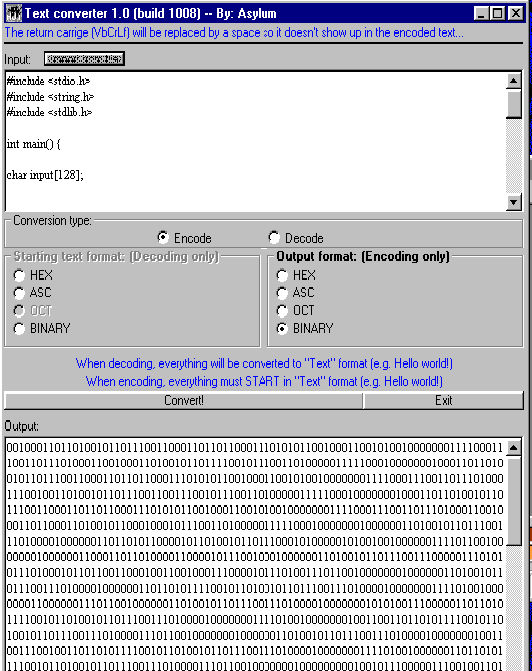



## \[^ Text converter \(Binary/Hex/Asc/Oct\) ^\]

### Description

This program comes with two classes and will convert a string to Asc, Oct, Hex, or Binary and back again... You can either type the input you want to be converted, or load it directly from any file type. I can't go as far to say that it's heavily commented, but it is commented and includes a website article that will explain why 2 of my functions work (string - binary, and binary - hex).
 
### More Info
 

             |
---                |---
**Submitted On**   |2004-03-17 20:49:52
**By**             |[Asylum\]oL\
**Level**          |Beginner
**User Rating**    |4.7 (75 globes from 16 users)
**Compatibility**  |VB 3\.0, VB 4\.0 \(16\-bit\), VB 4\.0 \(32\-bit\), VB 5\.0, VB 6\.0, VB Script
**Category**       |[Complete Applications](https://github.com/Planet-Source-Code/PSCIndex/blob/master/ByCategory/complete-applications__1-27.md)
**World**          |[Visual Basic](https://github.com/Planet-Source-Code/PSCIndex/blob/master/ByWorld/visual-basic.md)
**Archive File**   |[\[^\_Text\_co1721323172004\.zip](https://github.com/Planet-Source-Code/asylum-ol-text-converter-binary-hex-asc-oct__1-52444/archive/master.zip)

